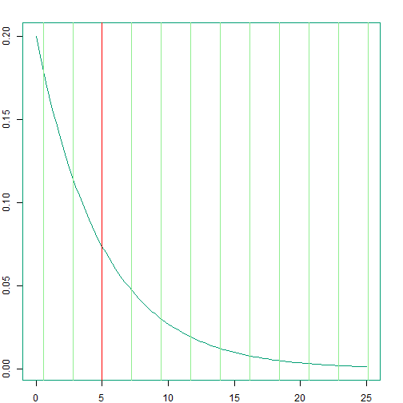
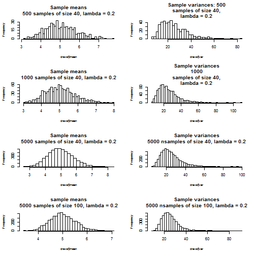

Central Limit Theorem and Asymptotics Simulation
===
author: Melancurion
date: 19 October 2015
transition: rotate
font-family: helvetica

Summary
===

My Shiny application was motivated by classwork in the Statistical Inference course within the JHU / Coursera Data Science Specialization --- especially by the treatment of the Central Limit Theorem and asymptotics. The simulation is available at the following URL:
https://melancurion.shinyapps.io/DDP-Project

- The exponential distribution is obviously non-gaussian. It seemed a reasonable choice to contrast the sampling statistics distributions with the underlying population distribution.

- The Shiny app allows the user to investigate interactively how the the distribution of sample means approaches normality with a large number of samples.

Description
===
* The app displays:

    + the __long-run distribution__ of __sample means__ and __sample variances__ of random samples from an underlying exponentially distributed population

    + a __histogram of exponential random draws__, and a theoretical __exponential distribution curve__

    + __asymptotic plots__ showing how cumulative sample means and variances converge on their respective estimators as the number of samples increases

* The user can change the default sampling parameters (number of draws, sample size, rate parameter) from __slider widgets__.

Underlying population distribution and distributions of sample means and variances
===

 

###### The exponential distribution has this form.

***
 

###### Distributions obtained by varying the parameters. In these examples, the exponential rate is 0.2 -- which can be altered by the user.

References
========================================================

Caffo, B., Course notes for Statistical Inference, part of JHU / Coursera Data Science Specialization:
https://github.com/bcaffo/courses/tree/master/06_StatisticalInference

Giles, Dave, "What's the Variance of a Sample Variance?", http://davegiles.blogspot.co.nz/2013/05/whats-variance-of-sample-variance.html,
May 17, 2013
